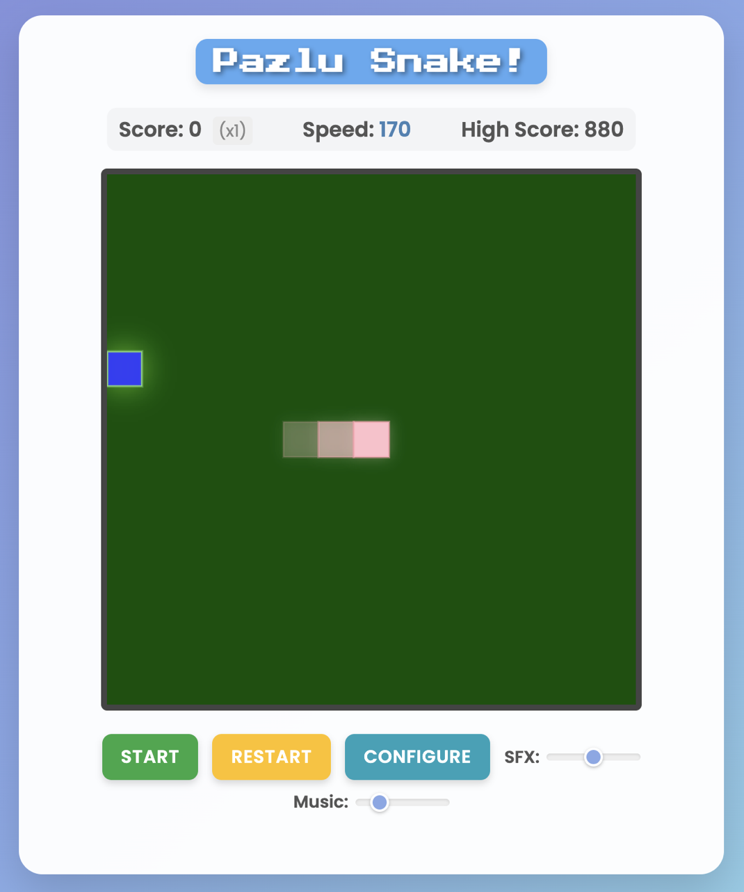

# Pazlu Snake

A modern implementation of the classic Snake game built with HTML5, CSS3, and JavaScript, featuring various enhancements and configurable options.

<!-- Add a screenshot or GIF of your game here! -->
<!--  -->
<!-- (You might need to create a 'docs' folder for images) -->

## Table of Contents

-   [Features](#features)
-   [How to Play](#how-to-play)
    -   [Keyboard Controls](#keyboard-controls)
    -   [Touch Controls (Mobile/Tablet)](#touch-controls-mobiletablet)
-   [Live Demo](#live-demo)
-   [How to Run Locally](#how-to-run-locally)
-   [Configuration](#configuration)
-   [Technologies Used](#technologies-used)
-   [Future Improvements](#future-improvements)
-   [Contributing](#contributing)
-   [License](#license)

## Features

*   **Classic Gameplay:** Eat food, grow longer, avoid collisions!
*   **Scoring & High Score:** Tracks your score and saves the highest score locally using `localStorage`.
*   **Increasing Difficulty:** Snake speed increases as you eat more food.
*   **Growth Milestones:** Visual changes as the snake grows (Eyes -> Teen Pattern -> Adult Nostrils).
*   **Wall Penalty:** Hitting a wall decreases your score (configurable amount).
*   **Obstacles:** Optional static obstacles on the map for an extra challenge (configurable).
*   **Power-ups:** Collect score multipliers (x2) that appear occasionally.
*   **Visual Effects:**
    *   Glow effects on snake and food.
    *   Particle effects when eating food/power-ups and subtle background particles.
    *   Screen shake effect on non-lethal wall hits.
    *   Score pop animation on increase.
*   **Sound Effects & Music:** Background music and sound effects for walking, eating, dying, and power-ups (with volume controls).
*   **Configuration Panel:** Customize game speed, colors (snake, food, background, obstacles, power-up), and enable/disable/configure obstacles.
*   **Keyboard & Touch Controls:** Playable on desktop and mobile/tablet devices.
*   **Modern Styling:** Clean UI with smooth transitions and animations.
*   **Responsive (Basic):** Layout adapts reasonably to different screen sizes.

## How to Play

The goal is to guide the snake to eat the food items that appear on the screen. Each item eaten makes the snake grow longer and increases your score. Avoid running into:

1.  The boundaries of the game area (causes score penalty and snake shrinkage).
2.  The snake's own body.
3.  Obstacles (if enabled).

The game ends if the snake collides with itself, an obstacle, or shrinks to zero length after hitting walls.

### Keyboard Controls

*   **Movement:** `Arrow Keys` (Up, Down, Left, Right) or `W`, `A`, `S`, `D` keys.
*   **Start / Pause / Resume:** `Spacebar`
*   **Restart Game:** `R` key (works anytime, including Game Over screen)

### Touch Controls (Mobile/Tablet)

*   **Movement:** Swipe **Up**, **Down**, **Left**, or **Right** anywhere on the game canvas.
*   **Start Game:** Tap the "Start" button or swipe on the canvas.
*   **Pause / Resume:** Tap the "Pause"/"Resume" button.
*   **Restart Game (After Game Over):** Tap anywhere on the screen or use the "Restart" button.

## Live Demo

**(Remember to Replace This Link!)**

You can play the game live here:

**[Play Pazlu Snake!](https://your-username.github.io/your-repo-name/)**

*(Replace `your-username` and `your-repo-name` with your actual GitHub details after deploying to GitHub Pages)*

## How to Run Locally

1.  **Clone or Download:**
    *   Clone the repository: `git clone https://github.com/your-username/your-repo-name.git`
    *   Or download the ZIP file and extract it.
2.  **Navigate:** Open the project folder in your file explorer or terminal.
3.  **Open `index.html`:** Double-click the `index.html` file to open it in your default web browser.
4.  **Audio Files:** Ensure all audio files (`background.mp3`, `walk.wav`, `eat.wav`, `oops.mp3`, `powerup.wav`) are present in the same directory as `index.html`.

*Note: Some browser security settings might restrict audio playback when opening files directly. Running through a local server or deploying online usually resolves this.*

**For Mobile Testing (Local Wi-Fi):**

1.  Ensure your computer and mobile device are on the **same Wi-Fi network**.
2.  Open a terminal/command prompt in the project folder.
3.  Run a simple HTTP server (requires Python or Node.js usually):
    *   Python 3: `python -m http.server 8000`
    *   Node.js (if `serve` is installed: `npm i -g serve`): `serve . -l 8000`
4.  Find your computer's local IP address (e.g., `192.168.1.10`).
5.  Open the browser on your mobile device and go to `http://YOUR_COMPUTER_IP:8000` (e.g., `http://192.168.1.10:8000`).

## Configuration

Click the "Configure" button to open the settings panel. You can customize:

*   **Initial Speed:** Controls how fast the snake moves at the start (lower value = faster).
*   **Colors:** Change the appearance of the Snake, Food, Background, Obstacles, and Power-ups.
*   **Enable Obstacles:** Toggle static obstacles on/off.
*   **Obstacle Count:** Set the number of obstacles (if enabled).

Click "Apply & Restart" to save the settings (stored in `localStorage`) and restart the game with the new configuration.

## Technologies Used

*   **HTML5:** Structure and Canvas element.
*   **CSS3:** Styling, animations, layout (Flexbox/Grid), custom properties (variables).
*   **JavaScript (ES6+):** Game logic, DOM manipulation, canvas rendering, event handling, `localStorage`.

## Future Improvements

*   More Power-up types (e.g., slow-down, shield, bonus points).
*   Different game modes (e.g., levels with increasing obstacles, time attack).
*   Visual indicator for power-up timer.
*   Difficulty settings affecting speed, obstacle frequency, etc.
*   Improved touch control options (e.g., on-screen D-pad).
*   Sound effect for wall hits (distinct from game over).
*   Online leaderboard (would require backend).

## Contributing

Contributions, issues, and feature requests are welcome! Feel free to check [issues page](https://github.com/your-username/your-repo-name/issues).

1.  Fork the Project
2.  Create your Feature Branch (`git checkout -b feature/AmazingFeature`)
3.  Commit your Changes (`git commit -m 'Add some AmazingFeature'`)
4.  Push to the Branch (`git push origin feature/AmazingFeature`)
5.  Open a Pull Request

## License

Distributed under the MIT License. See `LICENSE` file for more information.